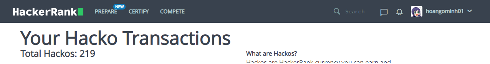

# Php-data-structures-algorithms

Thực hiện bởi [Ngô Minh Hoà](https://github.com/EmilRailgun)

# Data Structures

## Stack (Ngăn xếp)

&nbsp; Là kiểu cấu trúc dữ liệu cho phép người dùng thêm, bớt , xoá dữ liệu theo quy tắt nhất định. Quy tắc có thể là LIFO (Last In First Out) hoặc FILO (First In Last Out)

&nbsp; Ngăn xếp bao gồm 1 số hàm cơ bản

- `push()` - thêm một phần tử vào ngăn xếp
- `pop()` - xoá một phần tử khỏi ngăn xếp
- `top()` - lấy ra phần tử trên cùng của ngăn xếp
- `isEmpty()` - kiểm tra ngăn xếp có rỗng không
- `size()` - trả về kích thước của ngăn xếp

&nbsp; Khởi tạo:

```php
class stack
{
    protected $stack;

    public function __construct($ar = array())
    {
        $this->stack = $ar;
    }

    //check empty stack
    public function empty()
    {
        return empty($this->stack);
    }

    //get size of stack
    public function size()
    {
        return count($this->stack);
    }

    //get top of stack
    public function top()
    {
        return current($this->stack);
    }

    //push item to stack
    public function push($value)
    {
        array_unshift($this->stack, $value);
    }

    //pop item from stack
    public function pop()
    {
        if(empty($this->stack)) return;
        array_shift($this->stack);
    }
}

```

### `push()`

```php
public function push($value)
   {
       array_unshift($this->stack, $value);
   }

$stack = new stack();

$stack->push(1);
$stack->push(2);
$stack->push(3);
$stack->push(4);
$stack->push(5);


// result
// object(stack)#1 (1) { ["stack":protected]=> array(5) { [0]=> int(5) [1]=> int(4) [2]=> int(3) [3]=> int(2) [4]=> int(1) } }
```

### `pop()`

```php

//pop item from stack
    public function pop()
    {
        array_shift($this->stack);
    }

// result
// { ["stack":protected]=> array(4) { [0]=> int(4) [1]=> int(3) [2]=> int(2) [3]=> int(1) } }

```

### `top()`

```php

//get top of stack
    public function top()
    {
        return current($this->stack);
    }

// result
// int(4)

```

## Queue (Hàng đợi)

&nbsp; Hàng đợi là một cấu trúc dữ liệu trừu tượng khá tương đồng với Ngăn xếp (Stack). Nhưng không giống như Ngăn xếp, Hàng đợi sử dụng cả 2 đầu của danh sách. MỘt đầu để thêm dữ liệu (enqueue) và đầu còn lại để xoá dữ liệu (dequeue). Hàng đợi tuân theo quy tắc FIFO (First In First Out), dữ liệu thêm vào đầu sẽ được lấy ra trước.

&nbsp; Hàng đợi bao gồm một số hàm cơ bản

- `enqueue()` - Thêm 1 phần tử vào hàng đợi
- `dequeue()` - Xoá 1 phần tử khỏi hàng đợi
- `front()` - Lấy ra phần tử đầu tiên của hàng đợi
- `back()` - Lấy ra phần tử cuối cùng của hàng đợi
- `isEmpty()` - Kiểm tra hàng đợi rỗng
- `size()` - Trả về kích thước phần tử

&nbsp; Khởi tạo

```php

class queue
{
    protected $queue;
    protected $size;

    public function __construct($queue = array())
    {
        $this->queue = $queue;
    }

    //check empty queue
    public function empty()
    {
        return empty($this->queue);
    }

    //get size of queue
    public function size()
    {
        return count($this->queue);
    }

    // enqueue an item to the start of the queue
    public function enqueue($value)
    {
        array_unshift($this->queue, $value);
    }

    // dequeue an item from the queue
    public function dequeue()
    {
        return array_pop($this->queue);
    }

    // get first element
    public function front()
    {
        return $this->queue[0];
    }

    //get last element
    public function back()
    {
        return $this->queue[count($this->queue) - 1];
    }
```

### `enqueue()`

```php

    // enqueue an item to the start of the queue
    public function enqueue($value)
    {
        array_unshift($this->queue, $value);
    }
    //result
    // object(queue)#1 (2) { ["queue":protected]=> array(5) { [0]=> int(5) [1]=> int(4) [2]=> int(3) [3]=> int(2) [4]=> int(1) } ["size":protected]=> NULL }

```

### `dequeue()`

```php

// dequeue an item from the queue
    public function dequeue()
    {
        return array_pop($this->queue);
    }
// result
// object(queue)#1 (2) { ["queue":protected]=> array(4) { [0]=> int(5) [1]=> int(4) [2]=> int(3) [3]=> int(2) } ["size":protected]=> NULL }
```

### `front()`

```php

// get first element
    public function front()
    {
        return $this->queue[0];
    }
// result
// int(5)


```

### `back()`

```php

//get last element
    public function back()
    {
        return $this->queue[count($this->queue) - 1];
    }
// result
// int(2)

```

# Algorithms (Thuật toán)

## Search (Tìm kiếm)

### Linear Search

1. Duyệt tuần tự từ đầu đến cuối mảng
2. Nếu phần tự đang được duyệt bằng với yêu cầu thì trả về vị trí
3. Nếu không có phần tử nào thỏa mãn điều kiện thì trả về `-1`

&nbsp;Ví dụ:

```php
$ar = [1, 4, 6, 7, 8, 2, 5, 11, 10];

function linearSearch($arr, $x)
{
    for ($i = 0; $i < count($arr); $i++) {
        if ($arr[$i] === $x) {
            return $i;
        }
        return -1;
    }
}

var_dump(linearSearch($ar, 11)); // result int(7)
var_dump(linearSearch($ar, 12)); // result int(-1)

```

### Binary Search

<strong>Binary Search</strong> phù hợp với những mảng đã được sắp xếm theo thứ tự nhất định

1. Lấy giá trị của phần tử nằm ở trung tâm của mảng, so sánh với giá trị được yêu cầu
2. Nếu giá trị yêu cầu lớn hơn (nhỏ hơn) với giá trị phần tử trung tâm mảng thì thu hẹp phạm vi tìm kiếm về sau (trước) vị trí của phần tử trung tâm. Tiếp tục thu hẹp cho đến khi tìm thấy hoặc đã duyệt hết
3. Nếu tìm thấy trả về `true` còn ngược lại thì trả về `false`

&nbsp;Ví dụ

```php
function binarySearch($ar, $x, $start, $end)
{
    if ($start > $end) {
        return -1;
    }
    $mid = ($start + $end) / 2;
    if ($mid === $x) return $mid;
    if ($x < $ar[$mid]) binarySearch($ar, $x, $start, $mid - 1);
    else binarySearch($ar, $x,  $mid + 1, $end);
}
```

## Sort (Sắp xếp)

### Quick Sort

1. Lấy giá trị phần tử trung tâm của mảng, duyệt tuần tự từ đầu đến cuối mảng
2. Nếu phần tử đang được duyệt lớn hơn (nhỏ hơn) phần trung tâm thì xếp sang mảng con mới, cho đến khi không thể chia nữa thì ghép 2 mảng con lại cùng phần tử trung tâm

&nbsp;

```php
$ar = [1, 4, 6, 7, 8, 2, 5, 11, 10];

function quicksort($ar)
{
    if (count($ar) <= 1) {
        return $ar;
    }
    $pivot = $ar[count($ar) / 2];
    $left = [];
    $right = [];
    for ($i = 0; $i < count($ar); $i++) {
        if ($ar[$i] < $pivot) {
            array_unshift($left, $ar[$i]);
        }
        if ($ar[$i] > $pivot) {
            array_unshift($right, $ar[$i]);
        }
    }
    $left = quicksort($left);
    $right = quicksort($right);
    return array_merge($left, [$pivot], $right);
}

var_dump($ar);

// result
// array(9) { [0]=> int(1) [1]=> int(2) [2]=> int(4) [3]=> int(5) [4]=> int(6) [5]=> int(7) [6]=> int(8) [7]=> int(10) [8]=> int(11) }


```

### BogoSort

Sắp xếp ngẫu nhiên vị trí của các phần tử trong mảng cho đến khi thành mảng được sắp xếp

```php

$ar = [1, 4, 6, 7, 8, 2, 5, 11, 10];

function arraySortedOrNot($ar)
{
    for ($i = 0; $i < count($ar) - 1; $i++) {
        if ($ar[$i] > $ar[$i + 1]) {
            return false;
        }
    }
    return true;
}

function bogoSort($ar)
{
    if (count($ar) <= 1) {
        return $ar;
    }
    if (arraySortedOrNot($ar)) {
        return $ar;
    }
    shuffle($ar);
    return bogoSort($ar);
}

$ar = bogoSort($ar);
// result
//array(9) { [0]=> int(1) [1]=> int(2) [2]=> int(4) [3]=> int(5) [4]=> int(6) [5]=> int(7) [6]=> int(8) [7]=> int(10) [8]=> int(11) }
```

# Hacker Rank


